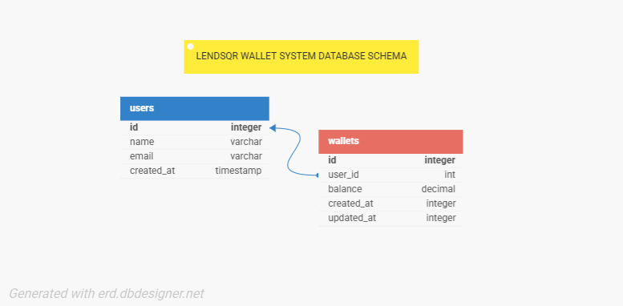

# Lendsqr Wallet Service

## Overview

This project is an MVP wallet service for a mobile lending app, built with NodeJS, TypeScript, KnexJS, and MySQL. It allows users to create accounts, fund wallets, transfer funds, withdraw funds, and ensures users on the Lendsqr Adjutor Karma blacklist cannot be onboarded.

## Features

- User account creation
- Fund wallet
- Transfer funds between users
- Withdraw funds
- Blacklist check via Lendsqr Adjutor Karma API
- Faux token-based authentication
- Unit tests for all endpoints

## Tech Stack

- NodeJS (LTS)
- TypeScript
- KnexJS ORM
- MySQL

## E-R Diagram

Below is an E-R diagram for the wallet service.



**Entities:**

- **User**: id, name, email
- **Wallet**: id, user_id (FK), balance

**Relationships:**

- One-to-one: Each user has one wallet

## Setup Instructions

### Prerequisites

- Node.js (LTS version)
- MySQL Server 8.0+
- Adjutor API key (get from [Adjutor Lendsqr](https://docs.adjutor.io/authentication/generating-your-api-key/))

### Installation

1. Clone the repository

   ```bash
   git clone <repository-url>
   cd tijani-sheu-lendsqr-be-test
   ```

2. Install dependencies

   ```bash
   npm install
   ```

3. Environment Configuration

   ```bash
   cp .env.example .env
   ```

   Then update `.env` with your actual values:

   - `DB_PASSWORD`: Your MySQL root password
   - `ADJUTOR_API_KEY`: Your Adjutor API key
   - `DB_NAME`: Database name (default: lendsqr_wallet)

4. Database Setup

   - Create the database:
     ```sql
     CREATE DATABASE lendsqr_wallet;
     ```
   - Run the migration script:
     ```bash
     mysql -u root -p lendsqr_wallet < src/models/migrations.sql
     ```

5. Start the server

   ```bash
   npm run dev
   ```

6. Run tests
   ```bash
   npm test
   ```

## API Endpoints

### User

- `POST /api/users` - Create a new user (checks blacklist)
  - Request: `{ name, email }`
  - Response: `{ id, name, email }` or error

### Wallet

- `POST /api/wallet/fund` - Fund a user's wallet
  - Request: `{ userId, amount }`
- `POST /api/wallet/transfer` - Transfer funds between users
  - Request: `{ fromUserId, toUserId, amount }`
- `POST /api/wallet/withdraw` - Withdraw funds from wallet
  - Request: `{ userId, amount }`

All wallet endpoints require a faux token in the `Authorization` header.

## Blacklist Integration

The service checks the Lendsqr Adjutor Karma blacklist API before onboarding a user. The API key is stored in `.env` and sent in the request header.

## Testing

Run unit tests with:

```
npm test
```

Tests are located in `src/tests/` and cover both positive and negative scenarios.

## Design & Architecture

- Modular structure: routes, controllers, models, middleware
- KnexJS for DB abstraction and transaction scoping
- Faux authentication for simplicity
- Environment variables for secrets

## Best Practices

- DRY/WET principles followed
- Consistent naming and organization
- RESTful, semantic API paths
- Transaction scoping for wallet operations
